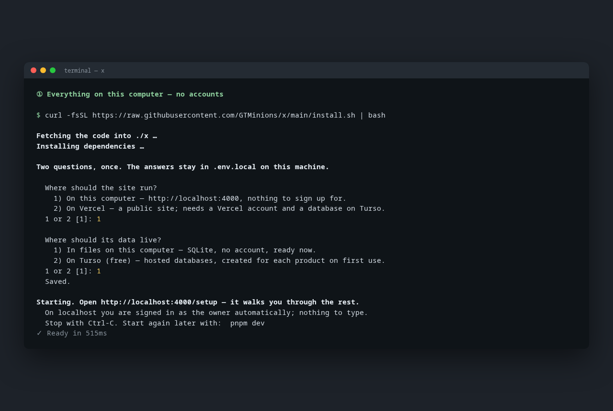
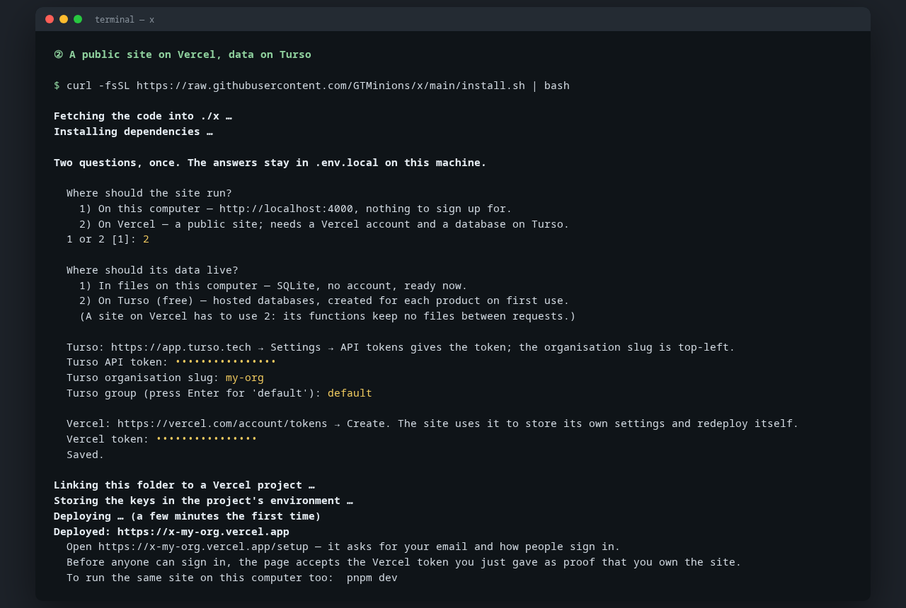
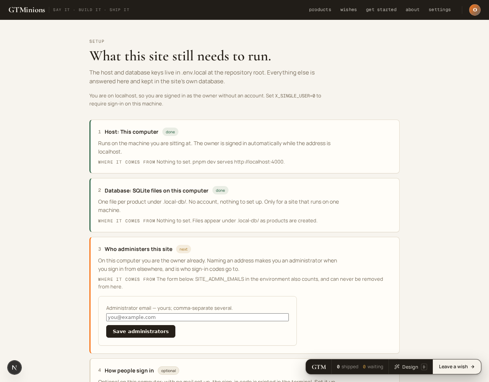
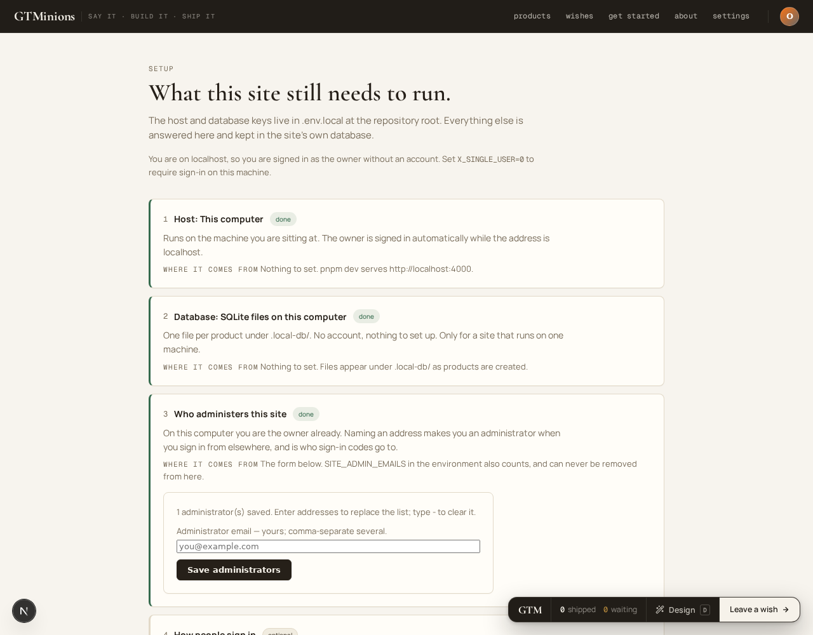
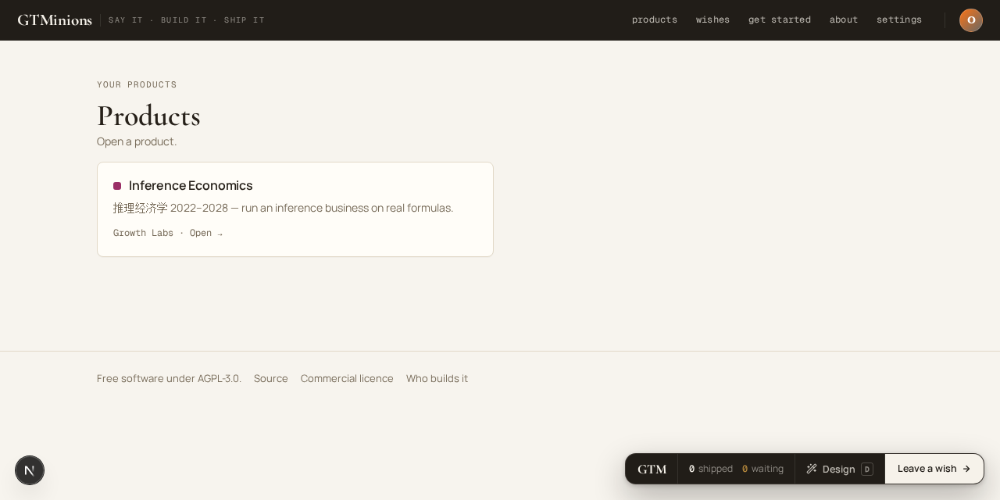
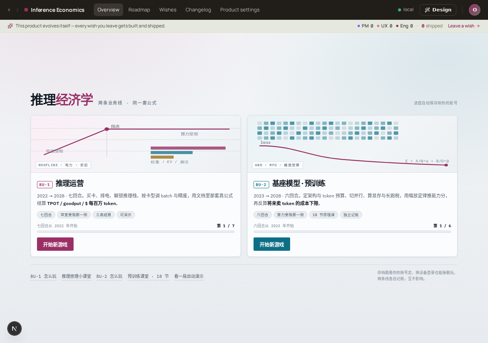

# x

Build a product with words, precisely.

Say what you want in a sentence. It gets built on a branch of its own,
reviewed by a person before it ships, and comes back with a receipt: what was
asked, what was done, what it cost. Every product keeps everything it knows in
a database you own.

**What you get**

- **Wishes instead of tickets.** Ask for something on any page. It becomes a
  wish with a receipt, and the build loop picks it up.
- **Products that are yours.** Each product is its own space with its own
  database, pages, words and wish board, isolated from every other.
- **A demo to start from.** Inference Economics, a business-simulation game,
  loads with one click so the site is never empty.
- **One command to run it.** On your machine with no accounts, or on Vercel
  and Turso when you want it public.
- **Open code, private content.** The code is open; what your products know
  never leaves your account.

## Get it running

One command. It asks two questions, then opens the site.

```bash
curl -fsSL https://raw.githubusercontent.com/GTMinions/x/main/install.sh | bash
```

Already have the code? `bash install.sh` inside the folder does the same.

It asks two questions, and they are independent:

| | Options | Needs |
|---|---|---|
| **Where the site runs** | this computer, or Vercel | Vercel: a free account and a token |
| **Where its data lives** | files on this computer, or Turso | Turso: a free account and a token |

Pick *this computer* twice to try it, or to keep it for yourself: nothing to
sign up for, and you are signed in as the owner
automatically. A site on Vercel keeps its data on Turso.

Then the browser opens on **/setup**. Everything else — your email, how people
sign in — is asked there, in a form, and kept in the site's own database.

## What it looks like

One command in a terminal, two ways to answer it.

**Everything on this computer.** No accounts; the site starts right away and
you are signed in as the owner on localhost:



**A public site on Vercel, data on Turso.** Two tokens, then the installer
links the project, stores the keys and deploys; the setup page asks the rest:



The setup page opens in the browser. The two keys are already there; the rest
is a form:



One click loads the demo, and the site is set up:



Your products, and the demo itself — a game that runs on the site's own
database:





## Use it

1. **Load the demo.** On the setup page, click *Load the demo product*.
   Inference Economics arrives complete: a business-simulation game
   (推理经济学 2022–2028) with its world, its pages and its words in a
   database of its own. Or click *Create product* to start an empty one.
2. **Play it.** `/inference-economics` runs an inference business on real
   formulas: buy GPUs, queue for power, tune batch and precision, settle each
   year. Progress saves to your account, so you can continue anywhere.
3. **Ask for things.** Every page has a wish button. Say what you want in plain
   words; it lands on the product's wish board with a receipt.
4. **Look under the hood.** The game's hardware, years and tech tree are rows
   in its database; `app/(products)/inference-economics/data/` holds the
   schema and the seed that bootstraps a fresh site.
5. **Deploy when you like.** Run the install command again in a fresh
   folder and answer *Vercel*; it links, stores the keys and deploys. The
   setup page can redeploy the site for you afterwards.

## Learn more

- [How it works](docs/HOW-IT-WORKS.md) — what a product is, where content
  lives, how wishes become code, the build gate.
- [Contributing](CONTRIBUTING.md) — for changes to the platform itself.
- [Licence](docs/HOW-IT-WORKS.md#licence) — the code is AGPL-3.0, the written
  content CC BY-NC-SA 4.0, and a commercial licence is available. Free to run,
  study and change; publish your modifications or take the commercial licence.
